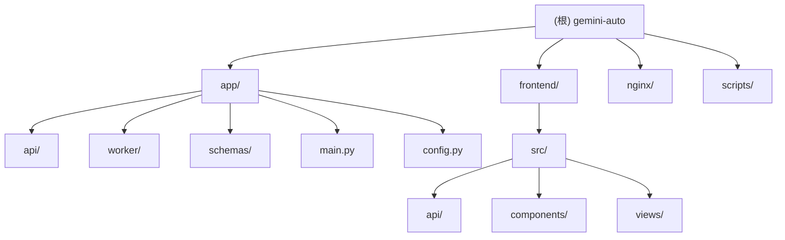

# Gemini Auto - AI 上下文文档

> 最后更新: 2026-01-15 08:40:18

## 变更记录 (Changelog)

### 2026-01-15 08:40:18
- 初始化 AI 上下文文档
- 完成项目架构扫描与模块识别
- 生成根级与模块级文档

---

## 项目愿景

Gemini Auto 是一个基于 FastAPI 后端和 Vue3 前端的 Web 应用，用于自动化注册 Gemini Business 账号。项目采用单 Docker 镜像部署方案，提供 Web UI 操作界面、实时任务监控、账号管理等功能。

**核心价值**
- 自动化注册流程，提高效率
- Web 界面友好，易于操作
- 单镜像部署，简化运维
- 实时日志流，透明可控

---

## 架构总览

### 技术栈

**后端**
- FastAPI 0.115.5 - 现代 Python Web 框架
- Uvicorn - ASGI 服务器
- Selenium + undetected-chromedriver - 浏览器自动化
- Pydantic - 数据验证与配置管理
- SSE (Server-Sent Events) - 实时日志推送

**前端**
- Vue 3.5.13 - 渐进式 JavaScript 框架
- Vite 6.0.3 - 前端构建工具
- Axios - HTTP 客户端

**基础设施**
- Nginx - 反向代理与静态资源服务
- Docker - 容器化部署
- Chrome/Chromium - 无头浏览器

### 部署架构

```
┌─────────────────────────────────────────┐
│         Docker Container (8080)         │
│                                         │
│  ┌───────────────────────────────────┐ │
│  │  Nginx (前端 + 反向代理)          │ │
│  │  - 静态资源: /app/static          │ │
│  │  - API 代理: → 127.0.0.1:8000    │ │
│  └───────────────────────────────────┘ │
│                  ↓                      │
│  ┌───────────────────────────────────┐ │
│  │  FastAPI (8000)                   │ │
│  │  - API 路由                       │ │
│  │  - 任务管理                       │ │
│  │  - SSE 日志流                     │ │
│  └───────────────────────────────────┘ │
│                  ↓                      │
│  ┌───────────────────────────────────┐ │
│  │  Worker (注册逻辑)                │ │
│  │  - 浏览器管理                     │ │
│  │  - 邮箱服务                       │ │
│  │  - 账号注册                       │ │
│  └───────────────────────────────────┘ │
│                  ↓                      │
│  ┌───────────────────────────────────┐ │
│  │  Chrome (Headless)                │ │
│  │  - 自动化注册流程                 │ │
│  └───────────────────────────────────┘ │
└─────────────────────────────────────────┘
```

---

## 模块结构图



---

## 模块索引

| 模块路径 | 职责 | 语言 | 入口文件 | 状态 |
|---------|------|------|---------|------|
| `app/` | FastAPI 后端服务 | Python | `main.py` | ✓ 已扫描 |
| `frontend/` | Vue3 前端应用 | JavaScript | `src/main.js` | ✓ 已扫描 |
| `nginx/` | Nginx 配置 | Conf | `default.conf` | ✓ 已扫描 |
| `scripts/` | 启动脚本 | Bash | `entrypoint.sh` | ✓ 已扫描 |

---

## 运行与开发

### 本地开发

**后端启动**
```bash
# 安装依赖
pip install -r requirements.txt

# 设置环境变量
export GEMINI_API_HOST="https://your-api-server.com"
export GEMINI_ADMIN_KEY="your-admin-key"
export GEMINI_HEADLESS_MODE="true"

# 启动服务
python -m uvicorn app.main:app --host 0.0.0.0 --port 8080 --reload
```

**前端开发**
```bash
cd frontend
npm install
npm run dev  # 开发服务器 (http://localhost:3000)
npm run build  # 构建生产版本 → ../app/static
```

### Docker 部署

**构建镜像**
```bash
docker build -t gemini-auto:latest .
```

**运行容器**
```bash
docker run -d \
  --name gemini-auto \
  -p 8080:8080 \
  -e GEMINI_API_HOST="https://your-api-server.com" \
  -e GEMINI_ADMIN_KEY="your-admin-key" \
  -e GEMINI_MAIL_API="https://mail.chatgpt.org.uk" \
  -e GEMINI_MAIL_KEY="gpt-test" \
  -e GEMINI_HEADLESS_MODE="true" \
  -v $(pwd)/data:/app/data \
  gemini-auto:latest
```

### 环境变量

| 变量名 | 必填 | 默认值 | 说明 |
|--------|------|--------|------|
| `GEMINI_API_HOST` | 是 | - | 服务器 API 地址 |
| `GEMINI_ADMIN_KEY` | 是 | - | 管理员密钥 |
| `GEMINI_MAIL_API` | 否 | `https://mail.chatgpt.org.uk` | 临时邮箱 API |
| `GEMINI_MAIL_KEY` | 否 | `gpt-test` | 邮箱 API 密钥 |
| `GEMINI_HEADLESS_MODE` | 否 | `true` | 浏览器无头模式 |
| `GEMINI_CONCURRENT_TASKS` | 否 | `1` | 并发任务数 |
| `GEMINI_LISTEN_PORT` | 否 | `8080` | Web 服务端口 |

---

## API 接口

### 健康检查
- `GET /health` - 服务健康状态

### 任务管理
- `POST /api/tasks` - 创建注册任务
- `GET /api/tasks/{id}` - 查询任务状态
- `DELETE /api/tasks/{id}` - 停止任务
- `GET /api/tasks/{id}/logs` - SSE 日志流

### 账号管理
- `GET /api/accounts` - 账号列表
- `GET /api/accounts/stats` - 账号统计
- `POST /api/accounts/upload` - 上传账号配置
- `DELETE /api/accounts/{email}` - 删除账号
- `POST /api/accounts/clear` - 清空账号

### 配置管理
- `GET /api/config` - 获取当前配置

---

## 测试策略

**当前状态**: 项目暂无自动化测试

**建议补充**
- 单元测试: 使用 pytest 测试核心业务逻辑
- API 测试: 使用 FastAPI TestClient 测试路由
- 前端测试: 使用 Vitest + Vue Test Utils
- E2E 测试: 使用 Playwright 测试完整流程

---

## 编码规范

### Python (后端)
- 遵循 PEP 8 规范
- 使用类型注解 (Type Hints)
- 文档字符串使用中文
- 配置管理使用 Pydantic Settings
- 异步优先 (async/await)

### JavaScript (前端)
- 使用 ES6+ 语法
- Vue 3 Composition API
- 组件化开发
- 响应式设计

### 通用规范
- 代码注释使用中文
- 提交信息使用英文 (遵循 Conventional Commits)
- 敏感信息通过环境变量配置

---

## AI 使用指引

### 项目特点
1. **单体应用**: 前后端在同一容器中运行，Nginx 作为入口
2. **无数据库**: 使用 JSON 文件存储账号数据 (`accounts.json`)
3. **内存任务队列**: 任务状态存储在内存中，重启后丢失
4. **浏览器自动化**: 核心逻辑依赖 Selenium + undetected-chromedriver

### 常见任务

**添加新 API 路由**
1. 在 `app/api/` 创建新路由文件
2. 在 `app/api/__init__.py` 导出路由
3. 在 `app/main.py` 注册路由

**修改注册逻辑**
- 核心文件: `app/worker/register.py`
- 浏览器管理: `app/worker/browser.py`
- 页面元素定位: `app/config.py` 中的 `XPATH`

**前端新增页面**
1. 在 `frontend/src/views/` 创建 Vue 组件
2. 在 `frontend/src/App.vue` 添加路由
3. 在 `frontend/src/api/index.js` 添加 API 调用

### 注意事项
- 修改配置后需重启服务
- 前端修改需重新构建 (`npm run build`)
- Docker 镜像需重新构建才能生效
- 浏览器自动化依赖页面结构，Google 更新可能导致失效

---

## 数据持久化

### 账号数据
- 文件: `accounts.json`
- 格式: JSON 数组
- 字段: `id`, `csesidx`, `config_id`, `secure_c_ses`, `host_c_oses`, `expires_at`

### 错误日志
- 文件: `errors.log`
- 格式: 文本日志
- 内容: 注册失败的邮箱与错误信息

### Docker 卷挂载
```bash
-v $(pwd)/data:/app/data  # 持久化数据目录
```

---

## 故障排查

### 常见问题

**1. 浏览器启动失败**
- 检查 Chrome 是否正确安装
- 检查 ChromeDriver 版本是否匹配
- 检查系统依赖是否完整

**2. 验证码获取超时**
- 检查邮箱 API 是否可用
- 检查网络连接
- 检查 API Key 是否正确

**3. 页面元素定位失败**
- Google 可能更新了页面结构
- 需要更新 `app/config.py` 中的 XPATH

**4. 任务卡住不动**
- 查看日志确认具体步骤
- 检查浏览器是否崩溃
- 尝试重启服务

### 日志查看

**Docker 容器日志**
```bash
docker logs -f gemini-auto
```

**应用日志**
- FastAPI 日志: 标准输出
- Nginx 日志: `/var/log/nginx/access.log`, `/var/log/nginx/error.log`
- 错误日志: `errors.log`

---

## 相关资源

- [FastAPI 文档](https://fastapi.tiangolo.com/)
- [Vue 3 文档](https://vuejs.org/)
- [Selenium 文档](https://www.selenium.dev/documentation/)
- [undetected-chromedriver](https://github.com/ultrafunkamsterdam/undetected-chromedriver)
