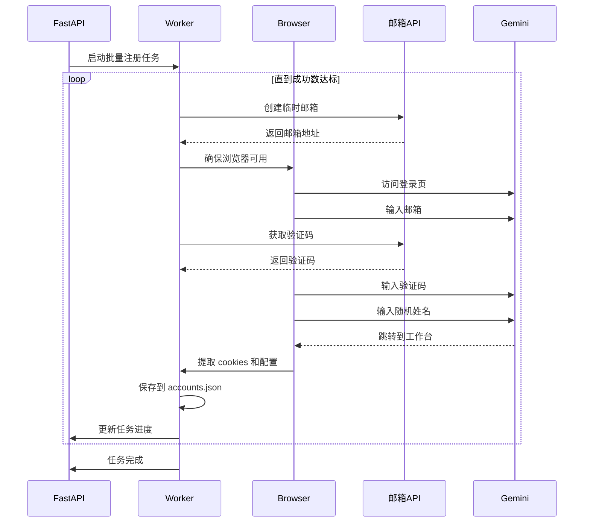

# app/ - 后端模块文档

> **导航**: [← 返回根目录](../CLAUDE.md)
> **最后更新**: 2026-01-15 08:40:18
> **模块类型**: FastAPI 后端服务

---

## 📋 模块概览

**app/** 是 Gemini Auto 的后端服务模块，基于 FastAPI 框架构建，负责提供 RESTful API 接口、任务管理、浏览器自动化和账号注册逻辑。

### 核心职责

- 🌐 **API 服务** - 提供 RESTful API 接口，处理前端请求
- 📊 **任务管理** - 创建、查询、停止注册任务，实时推送日志
- 🤖 **浏览器自动化** - 使用 Selenium 自动化 Gemini 注册流程
- 💾 **数据持久化** - 保存账号配置到 JSON 文件
- ⚙️ **配置管理** - 环境变量加载和配置管理

### 技术栈

- **FastAPI 0.115.5** - 现代化 Python Web 框架
- **Uvicorn** - ASGI 服务器
- **Pydantic** - 数据验证和配置管理
- **Selenium 4.27.1** - 浏览器自动化
- **undetected-chromedriver 3.5.5** - 反检测 ChromeDriver
- **SSE-Starlette** - 服务端推送事件

---

## 🏗️ 目录结构

```
app/
├── __init__.py              # 模块初始化
├── main.py                  # FastAPI 应用入口，路由注册
├── config.py                # 配置管理，环境变量加载
│
├── api/                     # API 路由模块
│   ├── __init__.py         # 路由导出
│   ├── health.py           # 健康检查接口
│   ├── tasks.py            # 任务管理接口
│   ├── accounts.py         # 账号管理接口
│   └── config.py           # 配置接口
│
├── worker/                  # 业务逻辑模块
│   ├── __init__.py
│   ├── register.py         # 注册核心逻辑
│   └── browser.py          # 浏览器管理器
│
├── schemas/                 # 数据模型
│   ├── __init__.py
│   ├── task.py             # 任务相关模型
│   └── account.py          # 账号相关模型
│
└── utils/                   # 工具函数
    └── __init__.py
```

---

## 🔑 关键文件说明

### 1. main.py - 应用入口

**位置**: `app/main.py`
**职责**: FastAPI 应用初始化、CORS 配置、路由注册

**关键代码**:
```python
# 创建 FastAPI 应用
app = FastAPI(
    title="Gemini Auto Web",
    description="Gemini Business 自动注册工具 Web 版",
    version="1.0.0",
    lifespan=lifespan,
)

# 注册路由
app.include_router(health_router)
app.include_router(tasks_router)
app.include_router(accounts_router)
app.include_router(config_router)
```

**启动方式**:
```bash
python -m uvicorn app.main:app --host 0.0.0.0 --port 8080
```

---

### 2. config.py - 配置管理

**位置**: `app/config.py`
**职责**: 环境变量加载、配置单例、页面元素定位

**配置类**:
```python
class Settings(BaseSettings):
    # 服务器 API 配置
    API_HOST: str = "请输入你的服务器API地址"
    ADMIN_KEY: str = "请输入你的管理员密钥"

    # 临时邮箱 API 配置
    MAIL_API: str = "https://mail.chatgpt.org.uk"
    MAIL_KEY: str = "gpt-test"

    # 浏览器配置
    HEADLESS_MODE: bool = True
    CONCURRENT_TASKS: int = 1

    # 服务器配置
    LISTEN_PORT: int = 8080

    class Config:
        env_prefix = "GEMINI_"  # 环境变量前缀
```

**页面元素定位**:
```python
XPATH = {
    "email_input": "/html/body/c-wiz/div/div/div[1]/div/div/div/form/div[1]/div[1]/div/span[2]/input",
    "continue_btn": "/html/body/c-wiz/div/div/div[1]/div/div/div/form/div[2]/div/button",
    "verify_btn": "/html/body/c-wiz/div/div/div[1]/div/div/div/form/div[2]/div/div[1]/span/div[1]/button",
}
```

---

### 3. api/tasks.py - 任务管理接口

**位置**: `app/api/tasks.py`
**职责**: 任务 CRUD 接口、SSE 日志流

**核心接口**:
- `POST /api/tasks` - 创建注册任务
- `GET /api/tasks/{id}` - 查询任务状态
- `DELETE /api/tasks/{id}` - 停止任务
- `GET /api/tasks/{id}/logs` - SSE 日志流

**任务存储**:
```python
# 内存存储（生产环境可换 Redis）
tasks: Dict[str, Dict[str, Any]] = {}
task_logs: Dict[str, list] = {}
```

**SSE 日志流实现**:
```python
async def log_generator():
    """日志流生成器"""
    last_index = 0
    while True:
        logs = task_logs.get(task_id, [])
        for log in logs[last_index:]:
            yield {"event": "log", "data": json.dumps(log)}
        last_index = len(logs)

        # 检查任务是否结束
        if task_status in [TaskStatus.COMPLETED, TaskStatus.FAILED]:
            break
        await asyncio.sleep(0.5)
```

---

### 4. worker/register.py - 注册核心逻辑

**位置**: `app/worker/register.py` (478 行)
**职责**: 批量注册、单账号注册、邮箱验证码获取

**核心函数**:

1. **批量注册** - `run_batch_registration()`
   - 循环注册直到达到目标数量
   - 预创建邮箱队列
   - 失败重试机制
   - 进度回调通知

2. **单账号注册** - `register_single_account()`
   - 访问登录页
   - 输入邮箱
   - 获取验证码
   - 输入验证码和姓名
   - 提取账号配置

3. **验证码获取** - `fetch_verification_code()`
   - 轮询邮箱 API
   - 解析 HTML 提取验证码
   - 超时处理

**注册流程**:
```python
async def register_single_account(browser, email):
    # 1. 访问登录页
    driver.get(LOGIN_URL)

    # 2. 输入邮箱
    inp = wait.until(EC.element_to_be_clickable((By.XPATH, XPATH["email_input"])))
    fast_type(inp, email)

    # 3. 获取验证码
    code = fetch_verification_code(email)

    # 4. 输入验证码
    pin = wait.until(EC.presence_of_element_located((By.CSS_SELECTOR, "input[name='pinInput']")))
    fast_type(pin, code)

    # 5. 输入姓名
    name = random.choice(NAMES)
    name_inp.send_keys(name)

    # 6. 保存配置
    config = save_account_config(email, driver)
```

---

### 5. worker/browser.py - 浏览器管理器

**位置**: `app/worker/browser.py`
**职责**: Chrome 浏览器实例管理、失败重试

**核心类**:
```python
class BrowserManager:
    def __init__(self):
        self.driver: Optional[uc.Chrome] = None
        self._consecutive_fails = 0
        self._MAX_CONSECUTIVE_FAILS = 20

    def ensure_driver(self) -> bool:
        """确保浏览器可用，异常时重启"""

    def reset_for_new_account(self):
        """清除 cookies，准备注册新账号"""

    def close(self):
        """关闭浏览器"""
```

**反检测配置**:
```python
options.add_argument("--disable-blink-features=AutomationControlled")
options.add_experimental_option("excludeSwitches", ["enable-automation"])
options.add_experimental_option("useAutomationExtension", False)
```

---

## 📊 数据模型

### 任务模型 (schemas/task.py)

```python
class TaskStatus(str, Enum):
    PENDING = "pending"
    RUNNING = "running"
    COMPLETED = "completed"
    FAILED = "failed"
    STOPPED = "stopped"

class TaskCreate(BaseModel):
    count: int = Field(ge=1, le=100)  # 注册数量
    upload_mode: str = "merge"        # 上传模式

class TaskResponse(BaseModel):
    id: str
    status: TaskStatus
    success_count: int
    fail_count: int
    total_time: float
    avg_time: float
```

### 账号模型 (schemas/account.py)

```python
class Account(BaseModel):
    id: str                    # 邮箱
    csesidx: str              # 会话索引
    config_id: str            # 配置 ID
    secure_c_ses: str         # 安全会话 Cookie
    host_c_oses: str          # 主机 Cookie
    expires_at: Optional[str] # 过期时间
    status: str = "active"    # 账号状态
```

---

## 🔄 核心流程

### 注册流程图



---

## 🌐 API 接口详情

### 健康检查

**GET /health**
```json
{
  "status": "ok",
  "uptime": 3600.5,
  "version": "1.0.0"
}
```

### 任务管理

**POST /api/tasks**
```json
// 请求
{
  "count": 5,
  "upload_mode": "merge"
}

// 响应
{
  "id": "a1b2c3d4",
  "status": "running",
  "count": 5,
  "success_count": 0,
  "fail_count": 0,
  "created_at": "2026-01-15T08:40:18"
}
```

**GET /api/tasks/{id}/logs** (SSE)
```
event: log
data: {"task_id":"a1b2c3d4","level":"INFO","message":"开始注册..."}

event: log
data: {"task_id":"a1b2c3d4","level":"OK","message":"注册成功"}

event: status
data: completed
```

---

## ⚙️ 配置说明

### 环境变量

| 变量名 | 类型 | 默认值 | 说明 |
|--------|------|--------|------|
| `GEMINI_API_HOST` | str | - | 服务器 API 地址 |
| `GEMINI_ADMIN_KEY` | str | - | 管理员密钥 |
| `GEMINI_MAIL_API` | str | `https://mail.chatgpt.org.uk` | 临时邮箱 API |
| `GEMINI_MAIL_KEY` | str | `gpt-test` | 邮箱 API 密钥 |
| `GEMINI_HEADLESS_MODE` | bool | `true` | 浏览器无头模式 |
| `GEMINI_CONCURRENT_TASKS` | int | `1` | 并发任务数 |
| `GEMINI_LISTEN_PORT` | int | `8080` | 监听端口 |

### 配置获取

```python
from app.config import get_settings

settings = get_settings()  # 单例模式
print(settings.API_HOST)
```

---

## 📝 开发指南

### 添加新 API 路由

1. 在 `app/api/` 创建新文件 `new_feature.py`
2. 定义路由:
```python
from fastapi import APIRouter

router = APIRouter(prefix="/new", tags=["新功能"])

@router.get("/")
async def get_new_feature():
    return {"message": "新功能"}
```

3. 在 `app/api/__init__.py` 导出:
```python
from .new_feature import router as new_router
```

4. 在 `app/main.py` 注册:
```python
app.include_router(new_router)
```

### 修改注册逻辑

**修改页面元素定位**:
- 编辑 `app/config.py` 中的 `XPATH` 字典
- 使用浏览器开发者工具获取新的 XPath

**修改注册流程**:
- 编辑 `app/worker/register.py` 中的 `register_single_account()` 函数
- 注意保持异常处理和日志记录

### 调试技巧

**启用浏览器可视化模式**:
```bash
export GEMINI_HEADLESS_MODE=false
python -m uvicorn app.main:app --reload
```

**查看详细日志**:
```bash
export GEMINI_LOG_LEVEL=DEBUG
python -m uvicorn app.main:app --log-level debug
```

---

## 🐛 常见问题

### 1. 浏览器启动失败

**原因**: Chrome/Chromium 未安装或版本不匹配

**解决**:
```bash
# 安装 Chrome
apt-get install chromium-browser

# 或使用 undetected-chromedriver 自动下载
pip install --upgrade undetected-chromedriver
```

### 2. 验证码获取超时

**原因**: 邮箱 API 不可用或网络问题

**解决**:
- 检查 `GEMINI_MAIL_API` 配置
- 测试邮箱 API 连通性
- 增加超时时间 (修改 `fetch_verification_code()` 的 `timeout` 参数)

### 3. 页面元素定位失败

**原因**: Google 更新了页面结构

**解决**:
- 使用浏览器访问 Gemini 登录页
- 使用开发者工具获取新的元素定位
- 更新 `app/config.py` 中的 `XPATH`

### 4. 连续失败达到上限

**原因**: 浏览器异常或网络问题

**解决**:
- 检查浏览器日志
- 重启服务
- 调整 `BrowserManager._MAX_CONSECUTIVE_FAILS` 参数

---

## 📊 性能优化

### 当前性能指标

- **单账号注册时间**: 平均 60-90 秒
- **并发任务数**: 1 (可配置)
- **内存占用**: ~200MB (含浏览器)

### 优化建议

1. **增加并发**: 修改 `GEMINI_CONCURRENT_TASKS` (需要更多资源)
2. **邮箱预创建**: 已实现邮箱队列机制
3. **浏览器复用**: 已实现浏览器实例复用
4. **失败快速跳过**: 已实现连续失败检测

---

## 🔒 安全注意事项

1. **敏感信息**: 所有密钥通过环境变量配置，不要硬编码
2. **CORS 配置**: 生产环境应限制允许的域名
3. **API 认证**: 当前无认证机制，建议添加 API Key 验证
4. **日志脱敏**: 避免在日志中输出完整的密钥和 Cookie

---

## 📄 依赖清单

```txt
fastapi==0.115.5
uvicorn[standard]==0.32.0
python-multipart==0.0.20
undetected-chromedriver==3.5.5
selenium==4.27.1
beautifulsoup4==4.12.3
requests==2.32.3
pydantic==2.10.1
pydantic-settings==2.6.1
aiofiles==24.1.0
sse-starlette==2.1.3
python-dateutil==2.9.0.post0
```

---

**文档生成时间**: 2026-01-15 08:40:18
**维护者**: 老王 (laowang-engineer)
