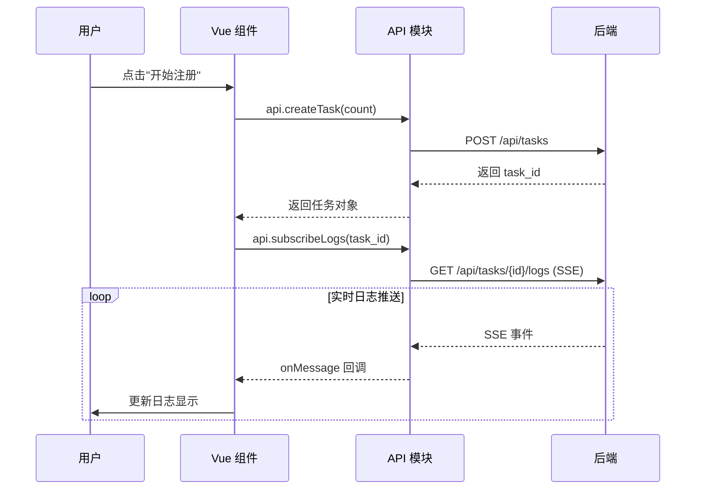

# frontend/ - 前端模块文档

> **导航**: [← 返回根目录](../CLAUDE.md)
> **最后更新**: 2026-01-15 08:40:18
> **模块类型**: Vue3 前端应用

---

## 📋 模块概览

**frontend/** 是 Gemini Auto 的前端应用模块，基于 Vue 3 + Vite 构建，提供现代化的 Web UI 界面，用于任务控制和账号管理。

### 核心职责

- 🎨 **用户界面** - 提供直观的 Web UI 操作界面
- 📊 **任务控制** - 创建、监控、停止注册任务
- 📋 **账号管理** - 查看、删除、统计账号信息
- 🔄 **实时日志** - 通过 SSE 接收并展示实时日志
- 🌐 **API 调用** - 封装后端 API 接口调用

### 技术栈

- **Vue 3.5.13** - 渐进式 JavaScript 框架 (Composition API)
- **Vite 6.0.3** - 下一代前端构建工具
- **Axios 1.7.9** - HTTP 客户端 (虽然引入但主要使用 fetch)
- **原生 EventSource** - SSE 客户端

---

## 🏗️ 目录结构

```
frontend/
├── src/
│   ├── main.js              # Vue 应用入口
│   ├── App.vue              # 根组件，导航和路由
│   ├── style.css            # 全局样式
│   │
│   ├── api/                 # API 封装
│   │   └── index.js         # API 客户端和工具函数
│   │
│   ├── components/          # 通用组件
│   │   ├── StatusCard.vue   # 状态卡片组件
│   │   └── LogViewer.vue    # 日志查看器组件
│   │
│   └── views/               # 页面视图
│       ├── Dashboard.vue    # 仪表板页面 (任务控制)
│       └── Accounts.vue     # 账号管理页面
│
├── index.html               # HTML 模板
├── vite.config.js           # Vite 配置
├── package.json             # 依赖配置
└── node_modules/            # 依赖包 (构建时)
```

---

## 🔑 关键文件说明

### 1. main.js - 应用入口

**位置**: `frontend/src/main.js`
**职责**: Vue 应用初始化和挂载

**代码**:
```javascript
import { createApp } from 'vue'
import App from './App.vue'
import './style.css'

createApp(App).mount('#app')
```

**说明**:
- 使用 Vue 3 Composition API
- 导入全局样式
- 挂载到 `#app` DOM 节点

---

### 2. App.vue - 根组件

**位置**: `frontend/src/App.vue`
**职责**: 应用布局、导航切换、健康检查

**核心功能**:
1. **顶部导航** - 任务控制 / 账号管理切换
2. **健康检查** - 每 10 秒检查后端服务状态
3. **视图切换** - 根据 `currentView` 显示不同页面

**关键代码**:
```javascript
setup() {
  const currentView = ref('dashboard')
  const isHealthy = ref(false)

  const checkHealth = async () => {
    try {
      const res = await api.getHealth()
      isHealthy.value = res.status === 'healthy'
    } catch (e) {
      isHealthy.value = false
    }
  }

  onMounted(() => {
    checkHealth()
    healthCheckInterval = setInterval(checkHealth, 10000)
  })
}
```

**样式特点**:
- 毛玻璃效果导航栏 (`backdrop-filter: blur(10px)`)
- 渐变色激活状态 (`linear-gradient(135deg, #667eea 0%, #764ba2 100%)`)
- 在线状态指示器 (绿色/红色圆点)

---

### 3. api/index.js - API 封装

**位置**: `frontend/src/api/index.js`
**职责**: 封装所有后端 API 调用

**API 分类**:

#### 健康检查
```javascript
async getHealth() {
  const res = await fetch('/api/health')
  return res.json()
}
```

#### 任务管理
```javascript
// 创建任务
async createTask(count, uploadMode = 'merge')

// 查询任务状态
async getTask(taskId)

// 停止任务
async stopTask(taskId)

// 订阅日志流 (SSE)
subscribeLogs(taskId, onMessage)
```

#### 账号管理
```javascript
// 获取账号列表
async getAccounts()

// 获取账号统计
async getAccountStats()

// 上传账号
async uploadAccounts(accounts, mode)

// 删除账号
async deleteAccount(email)

// 清空账号
async clearAccounts()
```

**工具函数**:
```javascript
// 格式化时间
formatTime(timestamp) // → "2026-01-15 08:40"

// 格式化时长
formatDuration(seconds) // → "1m 30s"
```

---

### 4. views/Dashboard.vue - 仪表板页面

**位置**: `frontend/src/views/Dashboard.vue`
**职责**: 任务创建、监控、日志展示

**核心功能**:
1. **任务创建表单** - 输入注册数量，选择上传模式
2. **任务状态卡片** - 显示成功/失败数、平均时长
3. **实时日志查看器** - SSE 流式接收日志
4. **停止任务按钮** - 手动停止正在运行的任务

**状态管理**:
```javascript
const taskId = ref(null)
const taskStatus = ref(null)
const isRunning = ref(false)
const logs = ref([])
```

**SSE 日志订阅**:
```javascript
const eventSource = api.subscribeLogs(taskId.value, (data) => {
  if (data.type === 'status') {
    // 任务状态变更
    taskStatus.value = data.status
  } else {
    // 日志消息
    logs.value.push(data)
  }
})
```

---

### 5. views/Accounts.vue - 账号管理页面

**位置**: `frontend/src/views/Accounts.vue`
**职责**: 账号列表展示、删除、统计

**核心功能**:
1. **账号统计卡片** - 总数、活跃、禁用、过期
2. **账号列表表格** - 显示邮箱、配置 ID、过期时间、状态
3. **删除账号** - 单个删除或批量清空
4. **刷新列表** - 手动刷新账号数据

**数据加载**:
```javascript
const loadAccounts = async () => {
  try {
    const data = await api.getAccounts()
    accounts.value = data.accounts || []

    const stats = await api.getAccountStats()
    accountStats.value = stats
  } catch (e) {
    console.error('加载账号失败:', e)
  }
}
```

---

### 6. components/StatusCard.vue - 状态卡片

**位置**: `frontend/src/components/StatusCard.vue`
**职责**: 通用状态卡片组件

**Props**:
```javascript
{
  title: String,      // 卡片标题
  value: [String, Number], // 主要数值
  icon: String,       // 图标 emoji
  color: String,      // 主题色
  subtitle: String    // 副标题
}
```

**使用示例**:
```vue
<StatusCard
  title="成功数"
  :value="successCount"
  icon="✅"
  color="#4caf50"
  subtitle="已完成"
/>
```

---

### 7. components/LogViewer.vue - 日志查看器

**位置**: `frontend/src/components/LogViewer.vue`
**职责**: 实时日志展示组件

**Props**:
```javascript
{
  logs: Array,        // 日志数组
  maxHeight: String   // 最大高度
}
```

**功能特点**:
- 自动滚动到最新日志
- 日志级别颜色区分 (INFO/WARN/ERROR/OK)
- 时间戳格式化
- 虚拟滚动 (大量日志时性能优化)

**日志格式**:
```javascript
{
  task_id: "a1b2c3d4",
  timestamp: "2026-01-15T08:40:18",
  level: "INFO",
  message: "开始注册..."
}
```

---

## 🎨 样式设计

### 全局样式 (style.css)

**主题色**:
- 主色调: 紫色渐变 (`#667eea` → `#764ba2`)
- 成功色: `#4caf50`
- 警告色: `#ff9800`
- 错误色: `#f44336`

**布局**:
- 容器最大宽度: `1200px`
- 响应式设计: 支持移动端和桌面端
- 暗色主题: 深色背景 + 半透明卡片

**动画效果**:
- 按钮悬停: `transform: translateY(-2px)`
- 卡片阴影: `box-shadow: 0 4px 20px rgba(0,0,0,0.1)`
- 过渡动画: `transition: all 0.3s ease`

---

## 🔧 构建配置

### vite.config.js

**构建输出**:
```javascript
build: {
  outDir: '../app/static',  // 输出到后端静态目录
  emptyOutDir: true,        // 清空输出目录
  assetsDir: 'assets',      // 静态资源目录
}
```

**开发服务器**:
```javascript
server: {
  port: 3000,               // 开发端口
  proxy: {
    '/api': {
      target: 'http://localhost:8080',
      changeOrigin: true,
    },
  },
}
```

---

## 🚀 开发指南

### 本地开发

```bash
cd frontend

# 安装依赖
npm install

# 启动开发服务器
npm run dev

# 访问 http://localhost:3000
```

### 构建生产版本

```bash
cd frontend

# 构建
npm run build

# 输出到 ../app/static/
```

### 预览构建结果

```bash
npm run preview
```

---

## 📊 组件通信

### 父子组件通信

**Props 传递**:
```vue
<!-- 父组件 -->
<LogViewer :logs="logs" maxHeight="400px" />

<!-- 子组件 -->
<script>
export default {
  props: {
    logs: Array,
    maxHeight: String
  }
}
</script>
```

**事件触发**:
```vue
<!-- 子组件 -->
<button @click="$emit('delete', accountId)">删除</button>

<!-- 父组件 -->
<AccountItem @delete="handleDelete" />
```

---

## 🔄 状态管理

**当前方案**: 组件内部状态 (ref/reactive)

**未来优化**: 可考虑引入 Pinia 进行全局状态管理

**状态示例**:
```javascript
// Dashboard.vue
const taskId = ref(null)
const taskStatus = ref(null)
const isRunning = ref(false)
const logs = ref([])

// Accounts.vue
const accounts = ref([])
const accountStats = ref({})
const loading = ref(false)
```

---

## 🌐 API 调用流程



---

## 📝 开发规范

### 代码风格

- 使用 Vue 3 Composition API
- 使用 `<script setup>` 语法糖 (可选)
- 组件命名: PascalCase (如 `StatusCard.vue`)
- 变量命名: camelCase (如 `taskId`)

### 注释规范

```javascript
// 创建注册任务
async function createTask() {
  // 验证输入
  if (count.value < 1) return

  // 调用 API
  const task = await api.createTask(count.value)
}
```

### 错误处理

```javascript
try {
  const data = await api.getAccounts()
  accounts.value = data.accounts
} catch (e) {
  console.error('加载失败:', e)
  alert('加载账号失败，请重试')
}
```

---

## 🐛 常见问题

### 1. API 调用失败

**原因**: 后端服务未启动或端口不匹配

**解决**:
```bash
# 检查后端服务
curl http://localhost:8080/health

# 检查 Vite 代理配置
# vite.config.js 中的 proxy.target
```

### 2. SSE 连接断开

**原因**: 网络问题或后端任务结束

**解决**:
- SSE 会自动关闭，无需手动处理
- 检查 `eventSource.onerror` 回调

### 3. 构建后样式丢失

**原因**: 静态资源路径错误

**解决**:
```javascript
// vite.config.js
build: {
  assetsDir: 'assets',  // 确保路径正确
}
```

---

## 📦 依赖说明

```json
{
  "dependencies": {
    "vue": "^3.5.13",      // Vue 3 核心
    "axios": "^1.7.9"      // HTTP 客户端 (备用)
  },
  "devDependencies": {
    "@vitejs/plugin-vue": "^5.2.1",  // Vite Vue 插件
    "vite": "^6.0.3"                  // 构建工具
  }
}
```

---

## 🔍 性能优化

### 当前优化

1. **Vite 构建** - 快速冷启动和热更新
2. **按需加载** - 组件懒加载 (可扩展)
3. **日志限制** - 最多保留 1000 条日志

### 未来优化

1. **虚拟滚动** - 大量日志时使用虚拟列表
2. **代码分割** - 路由级别的代码分割
3. **PWA 支持** - 离线访问和推送通知

---

**文档生成时间**: 2026-01-15 08:40:18
**维护者**: 老王 (laowang-engineer)
